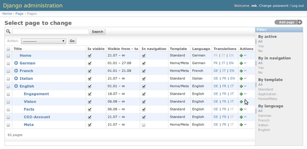

.. _index:

========================================
FeinCMS - An extensible Django-based CMS
========================================

FeinCMS is an extremely stupid content management system. It knows
nothing about content -- just enough to create an admin interface for
your own page content types. It lets you reorder page content blocks
using a drag-drop interface, and you can add as many content blocks
to a region (f.e. the sidebar, the main content region or something
else which I haven't thought of yet). It provides helper functions,
which provide ordered lists of page content blocks. That's all.

Adding your own content types is extremely easy. Do you like textile
that much, that you'd rather die than using a rich text editor?
Then add the following code to your project, and you can go on using the
CMS without being forced to use whatever the developers deemed best:

::

    from feincms.module.page.models import Page
    from django.contrib.markup.templatetags.markup import textile
    from django.db import models

    class TextilePageContent(models.Model):
        content = models.TextField()

        def render(self, **kwargs):
            return textile(self.content)

    Page.create_content_type(TextilePageContent)

That's it. Not even ten lines for your own page content type.

Contents
========

.. toctree::
   :maxdepth: 3

   installation
   page
   contenttypes
   admin
   integration
   medialibrary
   templatetags
   advanced/index
   faq
   contributing

API Documentation
=================

.. toctree::
   :maxdepth: 3

   api/core
   api/admin
   api/page
   api/medialibrary
   api/blog
   api/contenttypes
   api/contextprocessors
   api/contrib
   api/settings
   api/shortcuts
   api/templatetags
   api/translations
   api/utils
   api/views
   api/commands

Releases
========

.. toctree::
   :maxdepth: 1

   releases/1.3
   releases/1.2

Indices and tables
==================

* :ref:`genindex`
* :ref:`modindex`
* :ref:`search`
